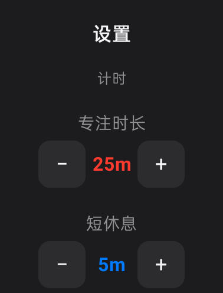
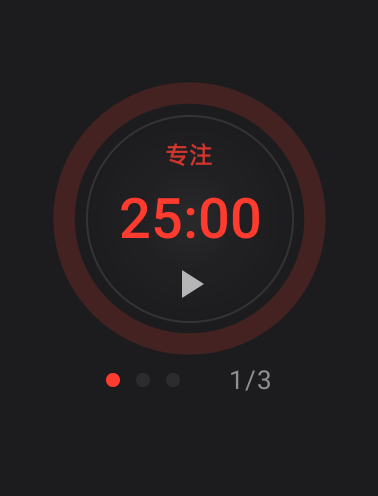
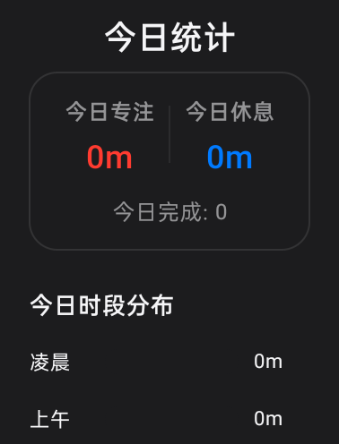

# PomoTick

PomoTick is a lightweight Pomodoro timer for watches and small-screen Android devices.

It helps you start a focus session quickly, notice break reminders, review today's focus time, and adjust the essentials without turning a tiny screen into a phone app.

The app is built around simple watch-first operation: large tap targets, clear timer states, compact stats, and bounded reminders that are hard to miss but easy to stop.

## UI Preview


| Settings | Timer | Stats |
|---|---|---|
|  |  |  |

Images used by this README live in `docs/images/` so they render correctly on GitHub.

## What It Does

- Runs focus, short break, and long break timers.
- Starts and pauses from the main timer screen.
- Opens reset and phase-switch actions with a long press.
- Shows a dedicated reminder screen when a timer ends.
- Stops sound and vibration immediately after your response.
- Tracks today's completed focus sessions and total focus time.
- Lets you adjust focus length, break length, long-break cadence, sound, and vibration.
- Shows reminder reliability checks and guides you to allow background running when needed.

## Development

- Kotlin
- Jetpack Compose and Material 3
- Room for completed sessions
- DataStore for runtime state and settings
- ForegroundService and AlarmManager for active timers and reminders

The app intentionally avoids dependency-injection frameworks, complex navigation, chart libraries, and Google Play Services for core behavior.

## Build

- JDK 17
- Android SDK
- Android Studio recommended

The project uses Gradle Wrapper, so a separate Gradle install is not required.

From the project root:

```powershell
.\gradlew.bat :app:assembleDebug --no-daemon
.\gradlew.bat :app:testDebugUnitTest --no-daemon
.\gradlew.bat :app:installDebug --no-daemon
```

The debug APK is generated at:

```text
app/build/outputs/apk/debug/app-debug.apk
```

## Project Structure

```text
app/src/main/java/com/pomotick/
├── MainActivity.kt
├── PomoTickApp.kt
├── alarm/      AlarmManager scheduling and receiver
├── data/       Room, DataStore, repository
├── timer/      pure timer state machine
├── service/    foreground timer service and notifications
├── reminder/   vibration and reminder sound
├── system/     system integration helpers
└── ui/         ViewModel, screens, theme
```

```text
docs/images/    README image assets
```

## Notes

- Allowing the app to run in the background improves reminder reliability.
- Local logs, debug scripts, temporary screenshots, and tool artifacts should not be committed. They are covered by `.gitignore`.
- Development constraints and product guardrails are documented in `AGENTS.md`.
